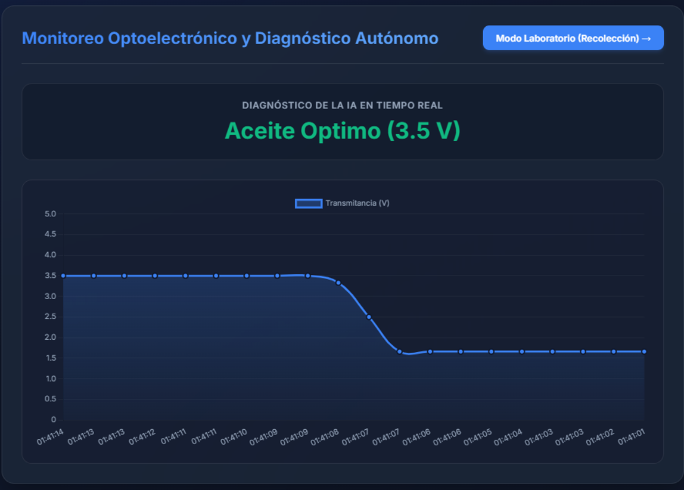
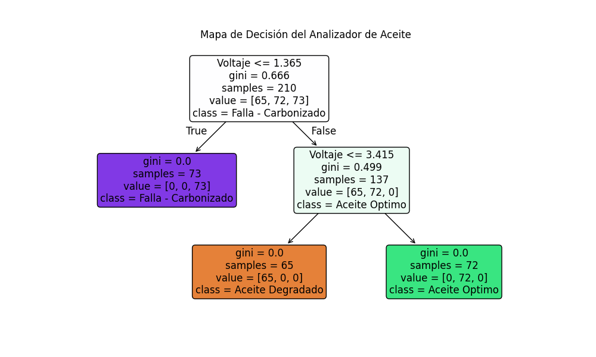

# ⚡🔬 Analizador Dieléctrico Optoelectrónico con IA


Un sistema ciberfísico integral de bajo costo diseñado para el monitoreo y diagnóstico autónomo de aceite dieléctrico. Este proyecto combina adquisición de señales a nivel hardware, transmisión serial, un servidor web interactivo y Machine Learning para emitir diagnósticos en tiempo real sobre el nivel de degradación del aceite. Es un prototipo ideal para estrategias de mantenimiento predictivo en subestaciones eléctricas y redes de distribución.

---

## 🎯 Descripción del Proyecto

El sistema evalúa el estado del aceite midiendo su transmitancia óptica. Cuando el aceite dieléctrico envejece o sufre arcos eléctricos, cambia su opacidad y genera partículas de carbón en suspensión. El hardware captura esta variación lumínica y la procesa mediante un árbol de decisión entrenado para clasificar el fluido en tres estados estrictos:

1. **🟢 Aceite Óptimo (> 3.415V):** Alta transmitancia lumínica.
2. **🟠 Aceite Degradado (1.365V - 3.415V):** Oscurecimiento por oxidación.
3. **🔴 Falla - Carbonizado (< 1.365V):** Bloqueo severo de luz debido a la presencia de partículas (carbón).

---

## 🏗️ Arquitectura del Sistema

El ecosistema está dividido en tres capas tecnológicas:

### 1. Capa de Hardware (Proteus & Microcontrolador)
* **Sensor:** Divisor de voltaje con LDR (Fotorresistencia) y un amplificador operacional LM358 configurado como seguidor de voltaje.
* **Procesamiento:** Microcontrolador **PIC18F45K50** programado en C (CCS C Compiler).
* **Firmware:** Adquisición analógica (ADC de 10 bits) y transmisión UART a 9600 baudios.

### 2. Capa Backend & Base de Datos
* **Servidor:** API desarrollada en **Flask** que orquesta la interfaz web.
* **Comunicación:** Hilo en segundo plano usando `pyserial` para leer el puerto COM y evitar cuellos de botella.
* **Almacenamiento:** Base de datos **SQLite** para el registro histórico y el etiquetado de muestras.

### 3. Capa de Inteligencia Artificial (Machine Learning)
* **Modelo:** `DecisionTreeClassifier` de la librería Scikit-Learn.
* **Entrenamiento:** Entrenado con datos físicos simulados para evitar sobreajuste, logrando un índice Gini de 0.0 en los nodos de decisión (pureza absoluta).
* **Inferencia:** El dashboard realiza peticiones asíncronas para evaluar los voltajes en tiempo real y emitir diagnósticos autónomos.

---

## 📸 Evidencia del Sistema

* **Dashboard Web de Inferencia en Tiempo Real:**
  

* **Estructura del Modelo (Árbol de Decisión):**
  

---

## 🚀 Guía de Instalación y Uso

### Prerrequisitos
* Python 3.8+
* Emulador de puertos seriales (ej. com0com o VSPE) configurado en el par `COM1 <-> COM2`.
* Proteus Design Suite (para la simulación del hardware).

### Instalación

1. **Clonar el repositorio:**
   ```bash
   git clone https://github.com/tu-usuario/analizador-dielectrico.git
   cd analizador-dielectrico
   ```

2. **Instalar las dependencias de Python:**
   ```bash
   pip install -r requirements.txt
   ```

3. **Ejecutar la Simulación de Hardware:**
   * Abre el archivo del esquemático en Proteus.
   * Verifica que el componente `COMPIM` esté en **COM1** a 9600 baudios.
   * Carga el firmware `.hex` en el PIC18F45K50 y arranca la simulación.

4. **Levantar el Servidor Web:**
   ```bash
   python app.py
   ```
   * Accede al Dashboard Inteligente: `http://127.0.0.1:5000/`
   * Accede al Modo de Etiquetado Manual (Laboratorio): `http://127.0.0.1:5000/laboratorio`

---

## 🛠️ Herramientas de Desarrollo
* **Lenguajes:** C, Python, JavaScript, HTML/CSS.
* **Bibliotecas de Datos:** Pandas, Scikit-Learn, Joblib, Matplotlib.
* **Simulación & Compilación:** Proteus, PIC C Compiler (CCS).

---
**Desarrollado por:** Ronaldo Fabrizio Bibiano Navarro  
*Ingeniería Electrónica - Especialidad en Mecatrónica* *Instituto Tecnológico de Lázaro Cárdenas (ITLAC)* *Lázaro Cárdenas, Michoacán, México*